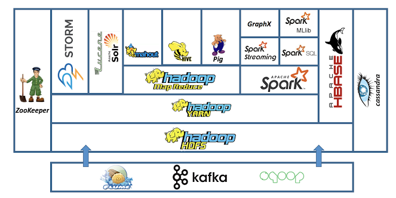
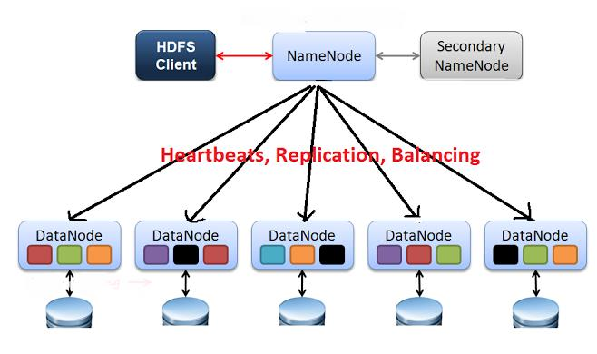
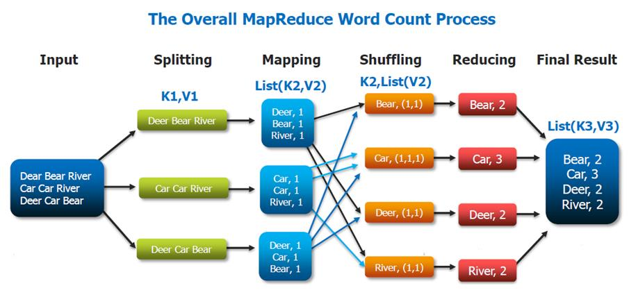

# 빅데이터

## 빅데이터란?
- 기관 또는 조직들이 생성하는 방대한 규모의 복잡한 데이터 묶음
    
- A Field that Treats way to Analyze
    - 거대한 데이터를 분석하는 방법을 다루는 어떤 분야
    
- Systematucally Extract Information
    - 시스템적으로 정보를 어디선가 추출 데이터 묶음을 분석하는 과정

### Data Sets : A Collection of Data
- 데이터 셋 : 

수집 된 데이터들의 집합 혹은 조합을 의미
다양한 형태로 만들어지며 행과 열 형태로 구성
빅데이터는 통합적이며 포괄적인 데이터
- 어느 한 부분의 데이터가 아닌 전체적인 데이터를 수집하여 연구

### 빅데이터의 특징
- 3V : 규모(Volume), 다양성(variety), 속도(Velocity)
- 5V : 규모(Volume), 다양성(variety), 속도(Velocity), 정확성(Veracity), 가치(value)

    - **규모(Volume)** : 기업이 관리하고 분석하는 빅 데이터 크기와 양
    - **가치(Value)** : 비즈니스 관점에서 가장 중요한 "V"인 빅데이터의 가치는 일반적으로 보다 효과적인 운영, 더 강력한 고객 관계 및 기타 명확하고 수량화 가능한 비즈니스 이점으로 이어지는 통찰력 발견 및 패턴 인식에서 나옵니다.
    - **다양성(Variety)** : 비정형 데이터, 반정형 데이터 및 원시 데이터를 포함하는 다양한 데이터 유형
    - **속도(Velocity)** : 회사가 데이터를 수신, 저장 및 관리하는 속도
        - (예: 특정 기간 내에 수신된 특정 소셜 미디어 게시물 또는 검색 쿼리 수)
    - **진실성(Veracity)** : 종종 경영진들의 신뢰도에 영향을 미치는 데이터 및 정보 자산의 "진실" 또는 정확성

- *Data Types*
    - 정형 데이터 (Structured Data)
        - 틀이 잡혀있는, 체계화 된 데이터로 우리가 흔히 엑셀에 정리된 자료를 생각하면 된다. 이미 해당 자료 수집 목적에 맞게 정리된 데이터 이기에 데이터 분석에 용이한 자료 형태이다.
    - 비정형 데이터 (Unstructured Data)
        - 구조화 되지 않은 데이터로 텍스트, 그림, 비디오 등이 있으며, 추가적인 분석을 위해서는 구조화된 형태로 변환해야 한다.
    - 반정형 데이터 (Semi-Structured Data)
        - HTML, JSON, Log 형태가 대표적으로 흔히 정형 데이터와 같은 구조의 정리된 데이터 모델을 준수하진 않지만 태그와 기타 마커 등을 통해 데이터 내의 레코드와 필드 계층이 구분된 데이터이다.
    - 원시 데이터 (Raw Data) 
        - 가공되지 않은 형태의 데이터를 가르키는데, 이는 일반적으로 데이터가 수집되거나 생성된 직후의 형태를 말한다. 원시 데이터는 일반적으로 구조화되지 않고, 정제되지 않은 상태이며, 처리되지 않은 형태입니다.
            - (예: 로그데이터, 센서 데이터, 이미지 및 비디오, 텍스트 데이터)

### 빅데이터를 활용한 사례들
- 페이팔, 사기 막기 위해 딥러닝 도입
- MLB, NFL에 빼앗긴 시장 되찾기 위해 빅데이터 도입
- GE(General Electric)
- 금융권
- [[사례들의 출처]](https://www.elec4.co.kr/article/articleView.asp?idx=15220)

## Hadoop (하둡)
- **Hadoop 이란?**
    - 대규모 데이터 집합을 분산 처리하는 데 사용되는 자바 기반의 오픈 소스 프레임워크
    - Apache Software Foundation에서 개발되었고, 대용량 데이터를 처리하고 저장하기 위한 여러 가지 도구와 라이브러리를 제공하며 이걸 Hadoop 생태계(Hadoop Ecosystem)라고 한다.
- **Hadoop의 특징**
    - *용이한 확장성*
        - 새로운 노드를 클러스터에 추가하여 시스템을 확장할 수 있으며, 처리량과 저장 용량을 필요에 따라 증가시킬 수 있다.
        - **클러스터란?**
            - 특정한 기능 수행을 위해 여러 대의 컴퓨터가 네트워크로 연결된 것을 의미하며, 이때 클러스터를 구성하는 개별 컴퓨터를 node라고 칭한다.
    - *저비용*
        -  오픈 소스로 제공되어 라이센스 비용이 없으며, 저렴한 컴퓨팅 자원을 활용하여 비용을 절감
    - *고용량 저장*
        - 대용량 데이터를 저장할 수 있는 분산 파일 시스템인 HDFS를 사용하여 데이터를 안전하게 저장하고 관리할 수 있습니다.
    - *유연한 데이터 처리*
        - 다양한 종류(정형, 비정형, 반정형)의 데이터를 처리할 수 있으며, MapReduce와 같은 프레임워크를 사용하여 데이터를 분석하고 처리할 수 있습니다.
        - 구조화된 데이터부터 비구조화된 데이터까지 다양한 형식의 데이터를 효과적으로 처리
    - *고가용성*
        - 데이터를 여러 복제본으로 저장하여 데이터의 손실을 방지하고
        , 노드나 컴퓨터의 고장에 대비하여 데이터를 안전하게 보호
    - *설치와 관리의 용이성*
        - 상대적으로 쉬운 설치 및 관리 프로세스를 가지고 있어,
        기업이 빠르게 환경을 구축하고 운영
    - *강력한 생태계*
        - 하둡 생태계에는 많은 다양한 도구와 프레임워크가 있으며, 이를 통해 빅데이터를 분석하고 인사이트를 추출할 수 있습니다.
        (예: HBase, Hive, Pig, Spark, Kafka 등)
        
### 하둡의 구성요소 (Hadoop Stack)
- *하둡 분산형 파일시스템(Hadoop Distributed File System, HDFS)*
    - 하둡 네트워크에 연결된 기기에 데이터를 저장하는 분산형 파일 시스템
    - **Hadoop HDFS**
        - 데이터를 저장하면, 다수의 노드에 복제 데이터도 함꼐 저장해서 데이터 유실을 방지
        - 대용량 데이터를 분산하여 저장하는 파일 시스템
        - 대용량 데이터를 블록(block)으로 분할하여 저장하며, 데이터 처리 작업에 있어서 중요한 역할

        **Hadoop HDFS Architecture**
        

        1. 블록 구조의 파일 시스템으로, 저장하는 파일은 특정 사이즈의 블록으로 나누어져 분산된 서버에 저장됨.
        2. 하나의 블록은 3개 (수정 가능)로 복제되며, 각각 다른 HDFS의 노드에 분산 저장됨
        3. HDFS에는 마스터 역할을 하는 네임노드 서버 한 대와, 슬레이브 역할을 하는 데이터 노드 서버가 여러 대로 구성된다.
        4. 네임 노드는 HDFS의 모든 메타데이터(블록들이 저장되는 디렉토리
        의 이름, 파일명등.)를 관리하고, 클라이언트가 이를 이용하여 HDFS
        에 저장된 파일에 접근할 수 있다.
        5.  하둡 어플리케이션은 HDFS에 파일을 저장하거나, 저장된 파일을 읽
        기 위해 HDFS 클라이언트를 사용하며, 클라이언트는 API형태로 사
        용자에게 제공된다.
        6. 데이터 노드는 주기적으로 네임노드에서 블록 리포트(노드에 저장되
        어 있는 블록의 정보)를 전송하고 이를 통해 네임노드는 데이터 노드
        가 정상 동작하는지 확인.
        7. 클라이언트는 네임노드에 접속해서 원하는 파일이 저장된 블록의 위
        치를 확인하고, 해당 블록이 저장된 데이터 노드에서 직접 데이터를
        조회함.

        **MapReduce**
        - 대규모 데이터 집합을 처리하는 분산 프로그래밍 모델 및 프레임워크
        - 데이터를 여러 노드에 분산하여 병렬로 처리하고, 각 노드에서의 작업 결과를
        모아 최종 결과를 생성
        - 주로 데이터의 필터링, 정렬, 그룹화, 집계 등의 작업에 사용

        **Map**
        - 흩어져 있는 데이터를 연관성 있는 데이터들로 분류하는 작업(Key, Value의 형태)

        **리듀스(Reduce)**
        - Map에서 출력된 데이터를 중복 데이터를 제거하고 원하는 데이터를 추출하는 작업

        - 
        1. Splitting : 문자열 데이터를 라인별로 나눈다.
        2. Mapping : 라인별로 문자열을 입력받아, <key, value> 형태로 출력.
        3. Shuffling : 같은 key를 가지는 데이터끼리 분류.
        4. Reducing : 각 key 별로 빈도수를 합산해서 출력.
        5. Final Result : 리듀스 메소드의 출력 데이터를 합쳐서 하둡 파일 시
        스템에 저장.

#### YARN(Yet Another Resource Negotiator)
- 클러스터의 자원 관리 및 작업 스케줄링을 담당하는 클러스터
관리 시스템
- 클러스터의 자원을 애플리케이션에 할당하고, 각 애플리케이션
의 실행을 관리
- 다양한 유형의 응용 프로그램을 실행하고 자원을 효율적으로
활용할 수 있도록 지원

**YARN**
- Hadoop 2.x 버전부터 소개되었으며, 이전 버전의 Hadoop 
MapReduce에서 사용되던 장애 복구 및 작업 스케줄링을 분리하여
더욱 유연한 클러스터 리소스 관리를 제공
- MapReduce의 단점을 극복하기 위해 시작된 프로젝트

1. **자원 관리(Resource Management)**
    - 클러스터의 물리적 자원(메모리, CPU 등)을 애플리케이션에 동적으로 할당하
    여 관리
    - 클러스터의 자원 사용률을 최적화하여 다양한 유형의 애플리케이션을 동시에
    실행할 수 있도록 합니다.

2. **작업 스케줄링(Job Scheduling)**
    - 다양한 유형의 작업(예: MapReduce 작업, Spark 작업 등)을 효율적으
    로 스케줄링하여 클러스터 자원을 최대한 활용합니다.
    - 여러 작업이 동시에 실행될 수 있도록 작업을 우선 순위에 따라 관리
    합니다.
3. **확장성 (Scalability)**
    - YARN은 클러스터의 크기를 수평으로 확장할 수 있도록 설계
    - 새로운 노드가 추가되면 자동으로 클러스터에 추가됩니다
4.  **유연성 (Flexibility)**
    - 다양한 유형의 애플리케이션을 실행할 수 있는 유연성을 제공
    - MapReduce, Spark, Tez 등 다양한 프레임워크와 도구를 지원
5. **고가용성 (High Availability)**
    - 클러스터의 중요한 부분을 여러 개의 노드에 분산하여 장애 복구 지원

#### hadoop common-Libaraies and Utilites
- Hadoop 프레임워크의 기본 기능을 제공하고 클러스터에서 작업
을 관리하는 데 도움이 되는 다양한 도구
- Hadoop 클러스터를 구축하고 관리하는 데 필요한 핵심 기능을
제공

**1. hadoop-common.jar**
- Hadoop 클러스터의 다른 모든 구성 요소에 공통으로 사용되는
    핵심 유틸리티 및 기능을 제공
- HDFS, MapReduce 및 기타 하둡 구성 요소의 기본 클래스 및
    인터페이스를 포함
**2. hadoop-auth.jar**
- Hadoop 보안 관련 라이브러리입니다. 이를 사용하여 사용자 인
증 및 권한 부여를 관리하고, 보안 기능을 활성화할 수 있습니다
**3. hadoop-common-tests.jar**
- Hadoop Common 코드의 유효성을 검증하고 테스트
**4. bin/hadoop**
-  Hadoop 클러스터를 시작하고 관리하기 위한 명령줄 인터페이스
- 다양한 하둡 커맨드를 실행하여 HDFS 파일 시스템 및 MapReduce
작업을 관리
**5. sbin/start-dfs.sh 및 sbin/stop-dfs.sh**
- DFS 데몬을 시작하고 중지하기 위한 스크립트
- 클러스터의 HDFS 구성 요소를 시작하거나 중지할 때 사용
**6. bin/start-yarn.sh 및 sbin/stop-yarn.sh**
- YARN 데몬을 시작하고 중지하기 위한 스크립트
- 클러스터의 YARN 구성 요소를 시작하거나 중지할 때 사용
**7. sbin/start-all.sh 및 sbin/stop-all.sh**
- 클러스터의 모든 데몬을 한 번에 시작하거나 중지하는 스크립트
- HDFS 및 YARN 데몬을 모두 시작하거나 중지할 때 사용